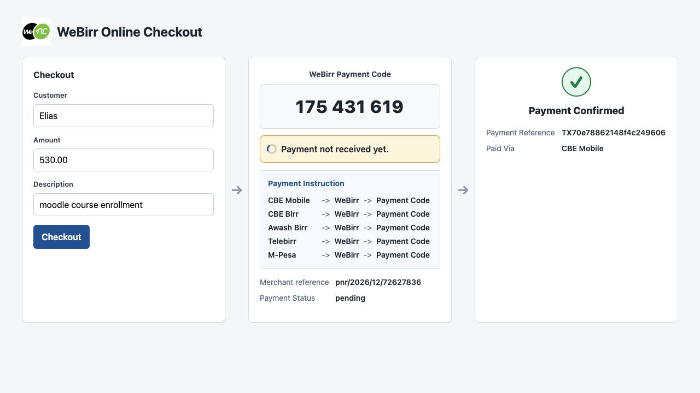

# WeBirr Moodle Plugin



This repository contains the WeBirr Moodle payment gateway plugin plus two
clearly separated example areas.

## Repository Layout

| Area | Path | Status |
| --- | --- | --- |
| Actual Moodle plugin | `plugin/webirr` | Production plugin source. This is the code that must be packaged as a Moodle plugin folder named `webirr`. |
| Moodle checkout example site | `examples/moodle-checkout-site` | Planned Docker/local Moodle demo environment that installs and exercises the actual plugin. This should become the preferred screenshot and release-validation path. |
| Standalone checkout demo | `examples/standalone-checkout-demo` | Standalone PHP checkout showcase. It uses the plugin's Moodle-native WeBirr client, but it is not the Moodle plugin flow. |

The standalone demo is useful for quickly showing the WeBirr online checkout
pattern without a Moodle install. The actual Moodle plugin remains the source
of truth for Moodle behavior.

## Actual Plugin

The Moodle plugin lives in `plugin/webirr`. It integrates WeBirr with Moodle's
payment gateway system and uses a Moodle-native WeBirr client, so it can be
packaged without requiring Composer installation on the Moodle server.

Features:

- Easy integration with Moodle's payment subsystem
- Simple payment experience with clear payment code display
- Real-time payment status monitoring
- Support for both test and production environments

Requirements:

- Moodle 4.5 LTS through Moodle 5.2
- PHP version supported by the target Moodle release
- WeBirr merchant account

Installation from source:

1. Copy `plugin/webirr` into Moodle as `payment/gateway/webirr`.
2. Visit Site administration > Notifications to complete installation.
3. Configure the payment gateway with your WeBirr API key and merchant ID.

Release packaging still needs a dedicated script/workflow so the release ZIP has
a top-level folder named `webirr`. See `docs/release-workflow.md`.

## How the WeBirr Integration Works

This plugin follows the WeBirr **online checkout pattern**. The browser does
not call WeBirr directly. Moodle provides two logged-in AJAX endpoints through
external functions:

| Checkout role | Moodle method | Source | WeBirr call |
| --- | --- | --- | --- |
| Create checkout/payment code | `paygw_webirr_get_code` | `plugin/webirr/classes/external/get_payment_code.php` | Server-side WeBirr bill/payment-code handling |
| Check payment status | `paygw_webirr_get_status` | `plugin/webirr/classes/external/get_payment_status.php` | Server-side WeBirr payment-status handling |

These endpoints are registered in `plugin/webirr/db/services.php` with
`ajax => true` and are called by `plugin/webirr/amd/src/repository.js` through
Moodle `core/ajax`. Merchant API credentials stay on the Moodle server. The
checkout endpoint returns the payment code, and the payment status endpoint
updates the local Moodle payment record and completes delivery when payment is
paid.

The calls are made through `plugin/webirr/classes/local/webirr_client.php`, so
the plugin package does not require Composer dependencies at runtime.

The plugin keeps checkout state on the Moodle server so page refreshes,
duplicate clicks, and interrupted browser sessions can be handled without
exposing merchant credentials to the browser.

## WeBirr Payment Flow

The plugin keeps the payment process simple for both Moodle and the customer:

1. A learner starts a Moodle purchase or paid enrollment checkout.
2. Moodle resolves the payable item, including amount, customer, description,
   and merchant configuration.
3. Moodle asks WeBirr to create or resume the bill/invoice using a stable
   merchant reference.
4. WeBirr returns a **WeBirr Payment Code** for that payable item.
5. Moodle displays the payment code to the learner and keeps the local payment
   record pending.
6. The learner opens a supported mobile banking or wallet app, such as CBE
   Mobile, CBE Birr, Telebirr, Awash Birr, M-Pesa, Coopay Ebirr, or another
   WeBirr-enabled app.
7. The learner follows the same general path in the selected app:
   `{Banking App} -> WeBirr menu -> Enter Payment Code -> Pay`.
   Current mobile apps integrated with WeBirr include CBE Mobile, CBE Birr,
   Awash Birr, Telebirr, M-Pesa, Coopay Ebirr, and other WeBirr-enabled banking
   or wallet apps.
8. The banking or wallet app sends the payment through WeBirr for that payment
   code.
9. Moodle polls its own payment-status endpoint. The server-side Moodle plugin
   checks WeBirr payment status and updates the local payment record.
10. When WeBirr reports the payment as paid, Moodle records the payment,
    redirects to success, and grants access to the purchased item.

The customer never enters Moodle or merchant API credentials in the banking app.
The WeBirr Payment Code connects the Moodle payable item to the payment made
from the customer's chosen banking or wallet app. Detailed customer payment
instructions are available on the WeBirr
[How to Pay](https://webirr.com/instructions/all.html) page.

## Examples

### Moodle Checkout Example Site

`examples/moodle-checkout-site` is reserved for a real Moodle demo environment
that installs `plugin/webirr` and validates the plugin flow inside Moodle. This
is the right place for Docker setup, seed data, and future screenshot capture
automation.

### Standalone Checkout Demo

`examples/standalone-checkout-demo` is a standalone PHP demo app. It shares the
actual plugin client in `plugin/webirr/classes/local/webirr_client.php`, but it
has its own HTML, CSS, JavaScript, demo API routes, and SQLite demo storage.

Run it with TestEnv credentials:

```sh
WEBIRR_TEST_ENV_MERCHANT_ID=your-test-merchant-id \
WEBIRR_TEST_ENV_API_KEY=your-test-api-key \
php -S 127.0.0.1:8096 examples/standalone-checkout-demo/index.php
```

Then open `http://127.0.0.1:8096/`.

## Release Status

This plugin is prepared as a Moodle Plugins directory review candidate.
Production use should follow normal Moodle plugin rollout practice: install in a
staging Moodle site first, configure a WeBirr TestEnv payment account, complete a
checkout validation with developer debugging enabled, and then promote the same
release package to production.
