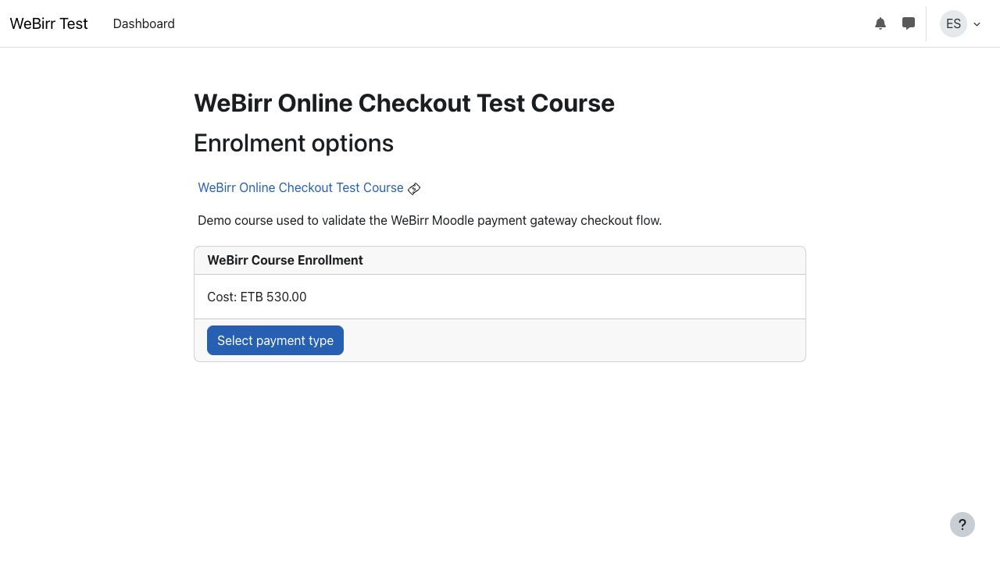
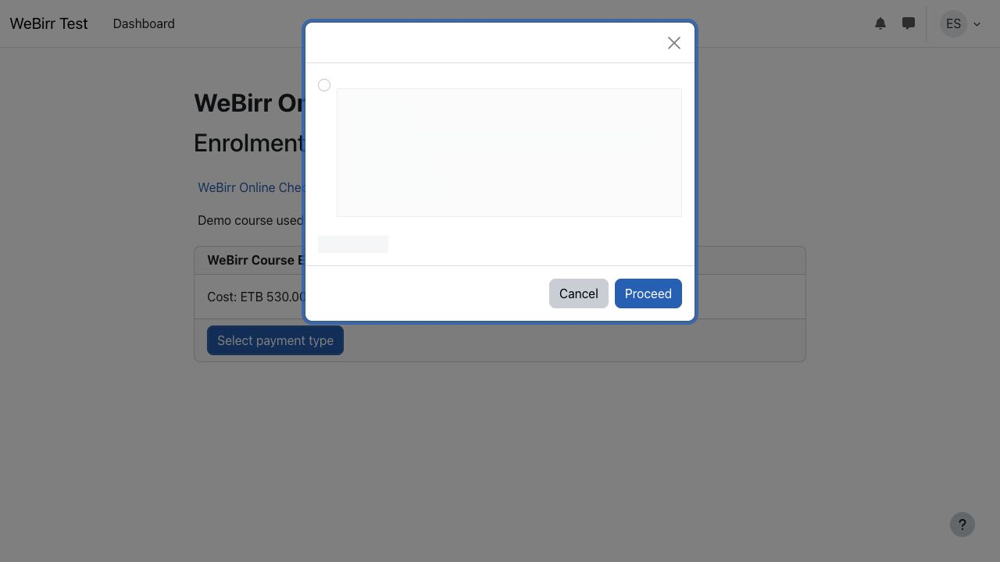
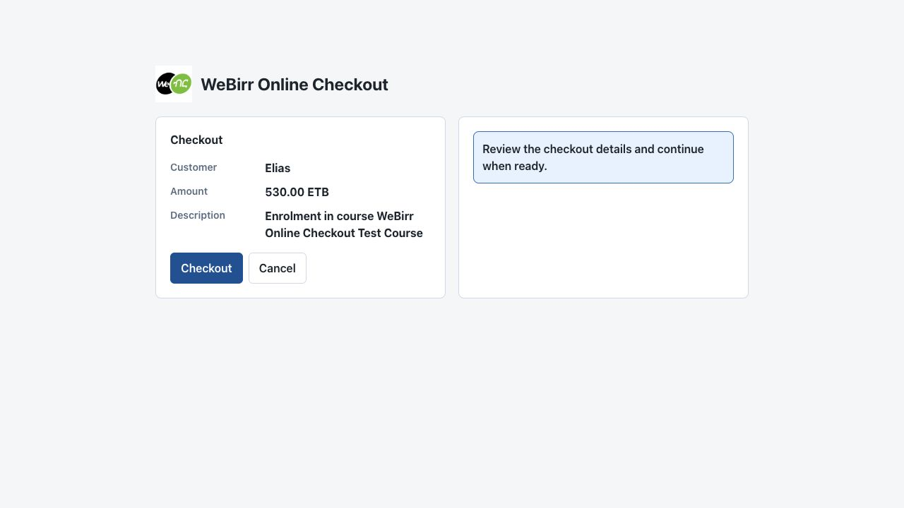
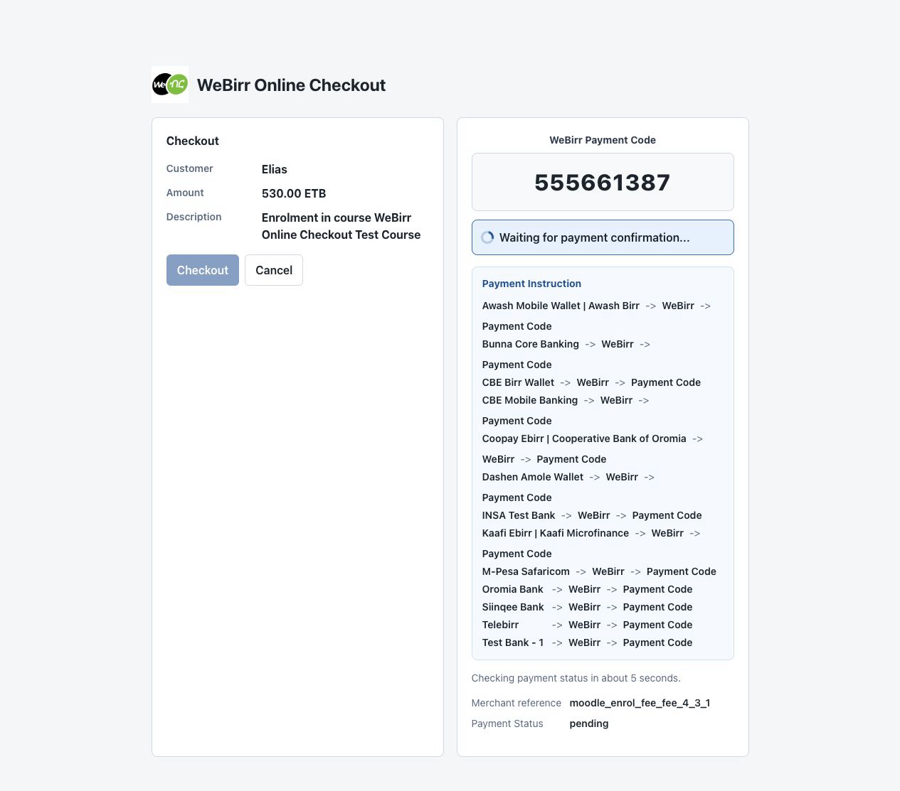
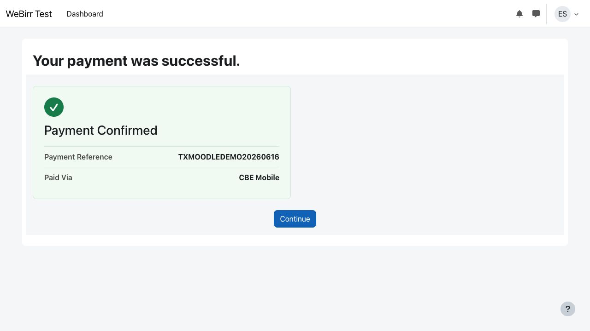

# Moodle Checkout Example Site

This Docker example runs a real Moodle site with the WeBirr payment gateway
plugin mounted from this repository.

The example uses the actual plugin source:

```text
../../plugin/webirr
```

It is intended for visual checks and release validation of the Moodle checkout
flow: Moodle paid enrolment, WeBirr payment selection, payment-code display,
server-side polling, and payment confirmation.

## Run

Copy the environment template and fill in WeBirr TestEnv credentials:

```sh
cp .env.example .env
```

Edit `.env` and set:

```text
WEBIRR_TEST_ENV_MERCHANT_ID=your-test-merchant-id
WEBIRR_TEST_ENV_API_KEY=your-test-api-key
```

Start and seed the Moodle site from this directory:

```sh
./scripts/bootstrap.sh
```

Open the printed Moodle URL. By default it is:

```text
http://localhost:8097/course/view.php?name=WEBIRR-CHECKOUT
```

Use the demo login printed by the script. The default username is:

```text
webirrstudent
```

The script uses this directory's `docker-compose.yml`, installs Moodle into
`.runtime/`, configures the payment account with the TestEnv merchant
credentials, creates a paid-enrolment test course, and mounts the plugin from
`../../plugin/webirr`.

## Checkout Flow

### 1. Moodle Course Payment

The learner starts from a Moodle paid-enrolment page. Moodle owns the payable
item, amount, account configuration, and access delivery.



### 2. Moodle Payment Selector

Moodle opens its payment selector and lists WeBirr as the available payment
gateway.



### 3. WeBirr Checkout

After the learner proceeds, the plugin opens the WeBirr checkout page. The
checkout page shows the Moodle customer, amount, and description before creating
the WeBirr bill/payment code.



### 4. Payment Code Display

When checkout starts, Moodle calls the plugin's server-side
`paygw_webirr_get_code` endpoint. The plugin creates or resumes the WeBirr bill,
stores the local payment record, and displays the **WeBirr Payment Code**.



### 5. Payment Confirmation

After WeBirr reports the payment as paid, the plugin completes Moodle payment
delivery and shows the confirmation page with the payment reference and channel.



## How the Customer Pays

The customer uses the displayed **WeBirr Payment Code** inside a mobile banking
or wallet app integrated with WeBirr.

The general customer path is:

```text
{Banking App} -> WeBirr -> Payment Code -> Pay
```

The plugin should not show a broad static banking or wallet list. It displays
only the subset returned by WeBirr for the configured merchant.

After the customer pays, browser JavaScript polls Moodle's
`paygw_webirr_get_status` endpoint. Moodle checks WeBirr payment status from the
server side, updates the local payment record, completes Moodle payment
delivery, and redirects to the success page.

## Screenshot Notes

The payment-code screenshot can be captured with a live TestEnv bill. For the
success screenshot, either complete the TestEnv payment externally or mark only
the disposable local Moodle payment row paid after the browser has left the
polling page.

Do not put real credentials in screenshots, README text, or committed `.env`
files.
