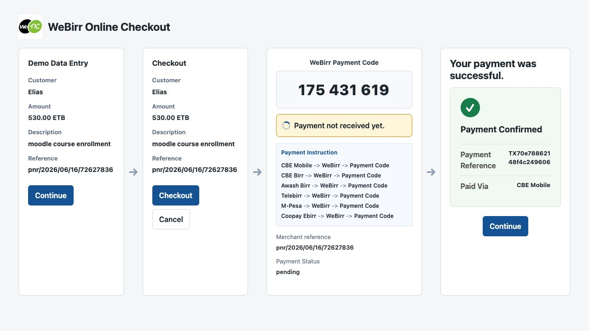
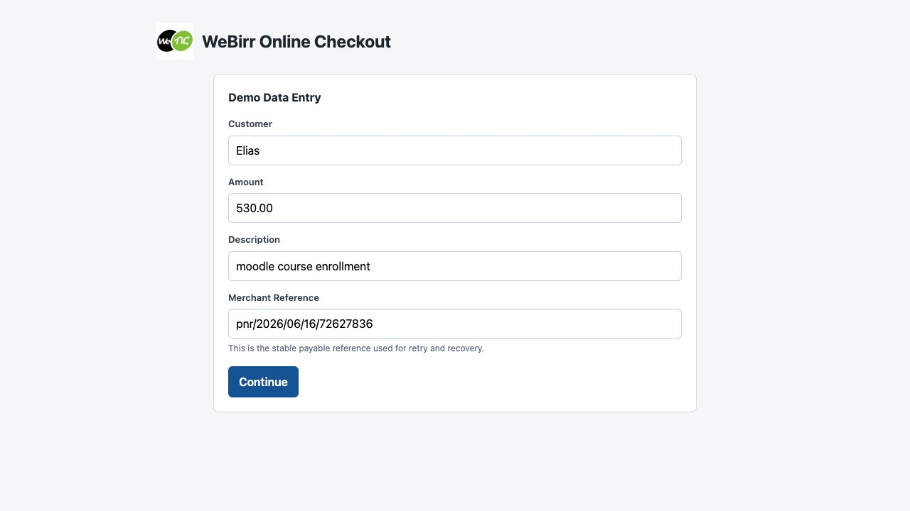
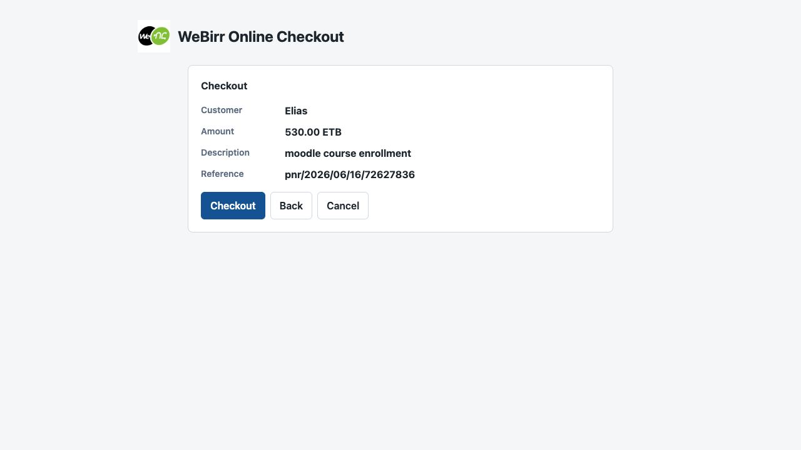
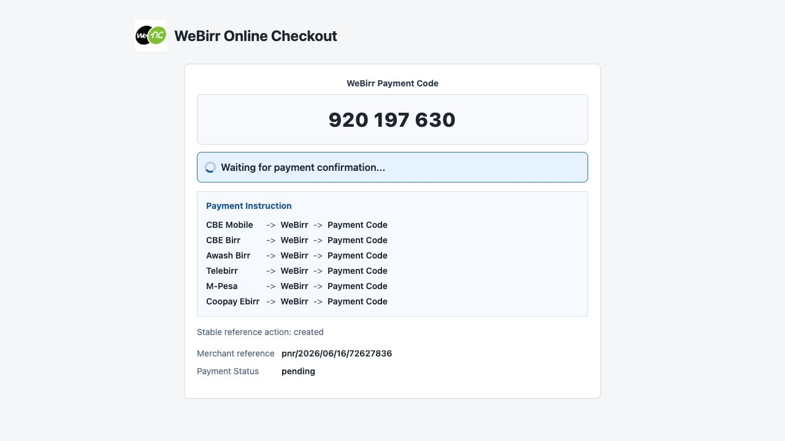
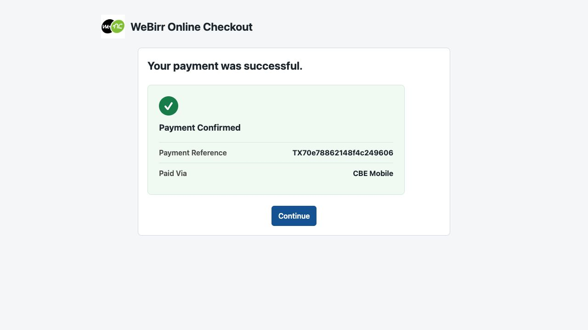

# Standalone Checkout Demo

This standalone PHP demo shows the WeBirr online checkout pattern without
installing Moodle.



The demo shares the actual Moodle plugin's WeBirr client:

```text
../../plugin/webirr/classes/local/webirr_client.php
```

It does not use Moodle's payment APIs, Moodle AJAX external functions, or the
plugin's AMD JavaScript. It has its own lightweight routes and SQLite demo
storage so the checkout pattern can be shown quickly from a local PHP server.

## Run

Set TestEnv credentials and start the local PHP server:

```sh
WEBIRR_TEST_ENV_MERCHANT_ID=your-test-merchant-id \
WEBIRR_TEST_ENV_API_KEY=your-test-api-key \
php -S 127.0.0.1:8096 examples/standalone-checkout-demo/index.php
```

Open `http://127.0.0.1:8096/`.

## Checkout Flow

### 1. Demo Data Entry

The first screen starts with editable default demo values: customer, amount,
description, and merchant reference. The merchant reference is the stable
payable reference used by the demo for retry and recovery.



### 2. Checkout Review

The next screen shows the checkout summary before creating the WeBirr bill and
payment code. The customer can continue with checkout, go back, or cancel.



### 3. Payment Code Display

When checkout starts, the server creates or resumes the WeBirr bill and displays
the **WeBirr Payment Code**. The browser does not call WeBirr directly; it calls
the local demo server, and the local server calls WeBirr.



### 4. Payment Confirmation

After payment is received, the screen changes to the confirmation view and shows
the payment reference and the channel used to pay.



## How the Customer Pays

The customer uses the displayed **WeBirr Payment Code** inside a mobile banking
or wallet app integrated with WeBirr.

The general customer path is:

```text
{Banking App} -> WeBirr -> Payment Code -> Pay
```

Current mobile apps integrated with WeBirr include CBE Mobile, CBE Birr, Awash
Birr, Telebirr, M-Pesa, Coopay Ebirr, and other WeBirr-enabled banking or
wallet apps.

After the customer pays, the demo checks WeBirr payment status from the server
side and updates the checkout screen from pending to confirmed.

## What This Demo Is For

Use this demo for quick visual and API checks of the online checkout pattern.
Use the Moodle checkout example site for release validation of the real Moodle
plugin flow.
